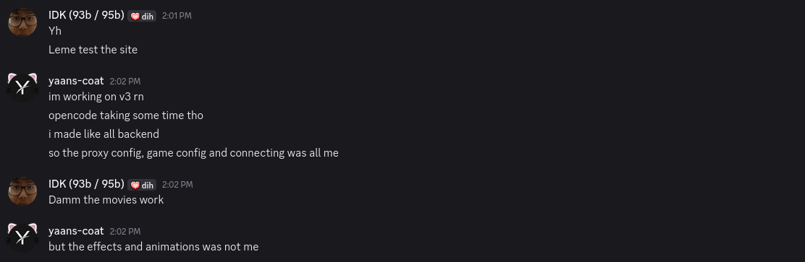

# Anariav3-leak

Hi, I'm [@beery-tomato](https://github.com/beery-tomato), I made this leak as a prank on yaans, he doesn't want ppl knowing so... also I got his gh account for like a couple days???

## discussions

.png)
.png)
.png)
.png)

the end

## Features

these were stolen from yaans-coat's personal documentation:

"adding ai would be the next big thing"
"open-router key is safely hidden"
"i decided to make my own music streaming with [x8rr's music api](https://gihtub.com/x8rr/music), i think i'll use yt music and soundcloud"
"i gotta talk to idk about some of the stuff"
"okay, working on back-end currently and im on a rooooollll"
